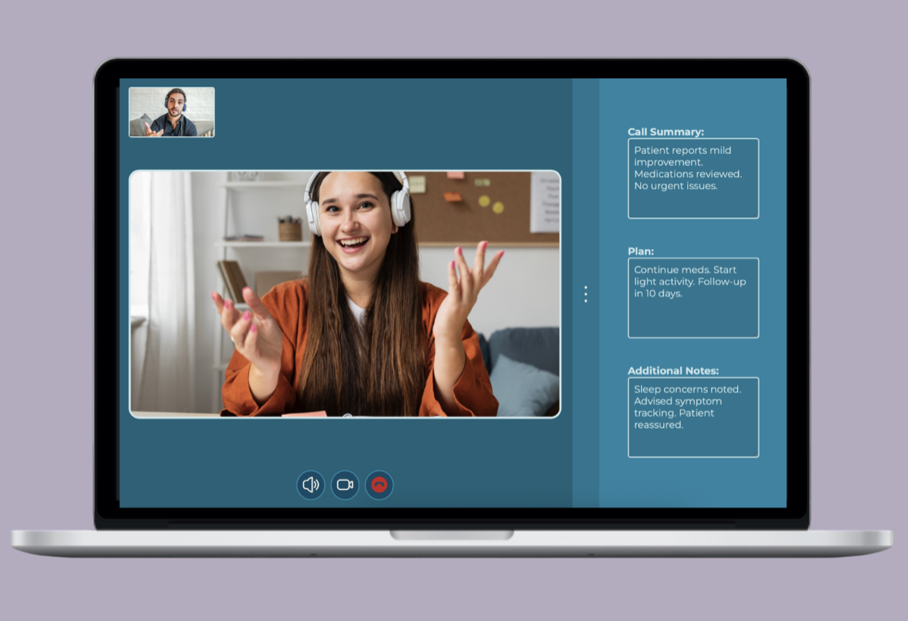
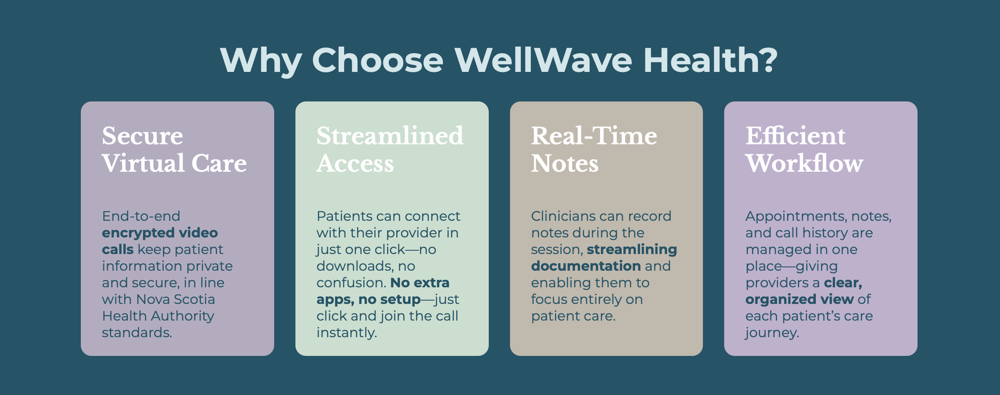
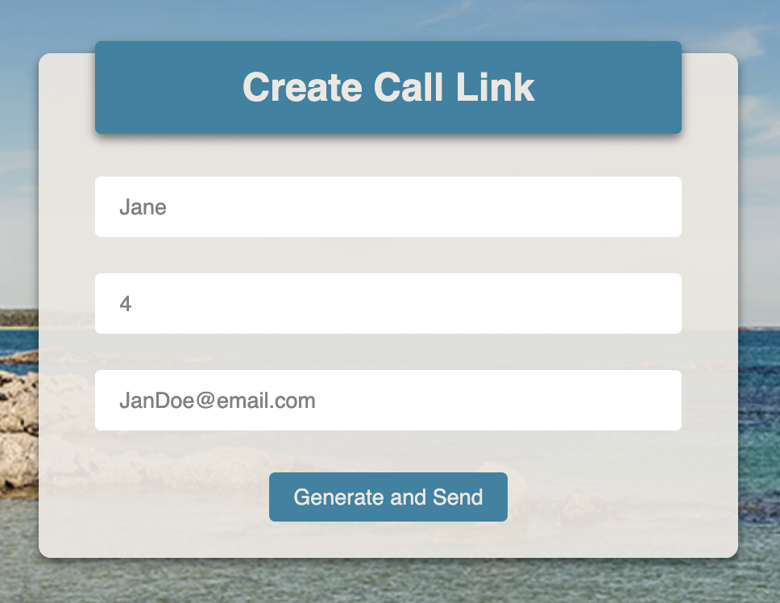
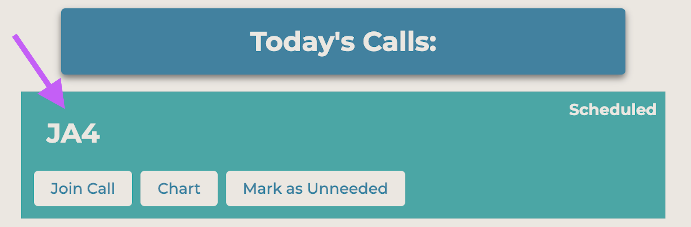
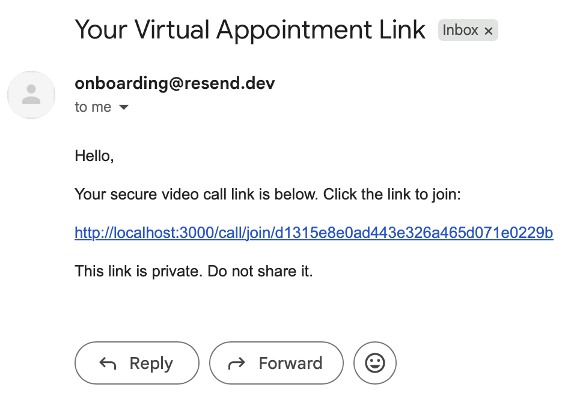
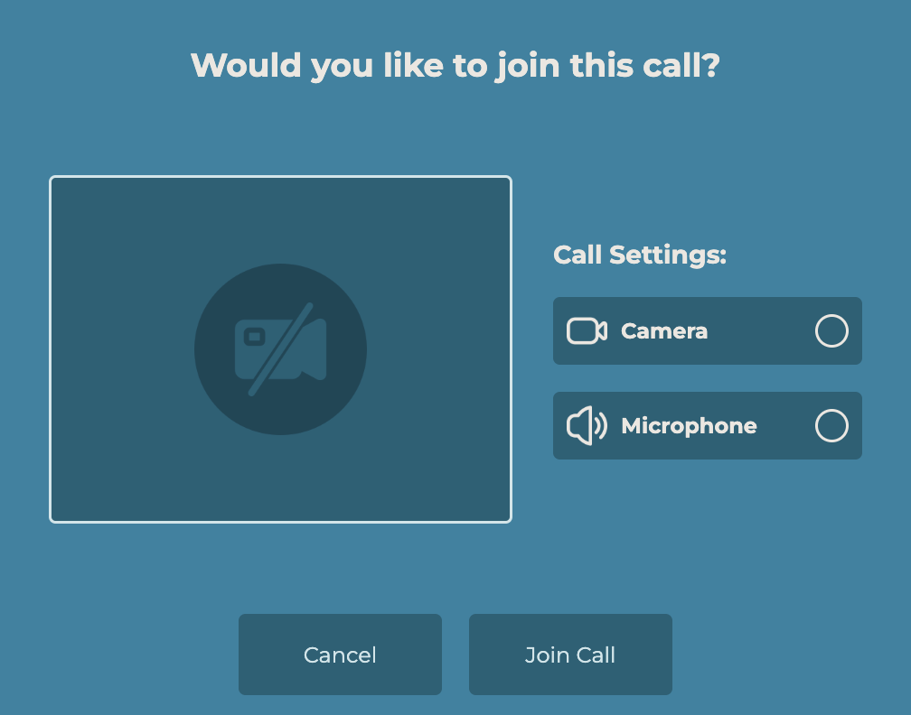
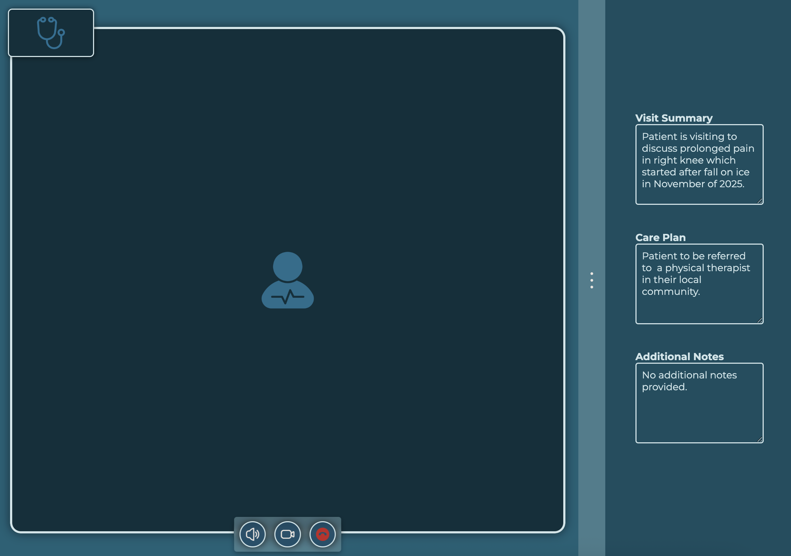
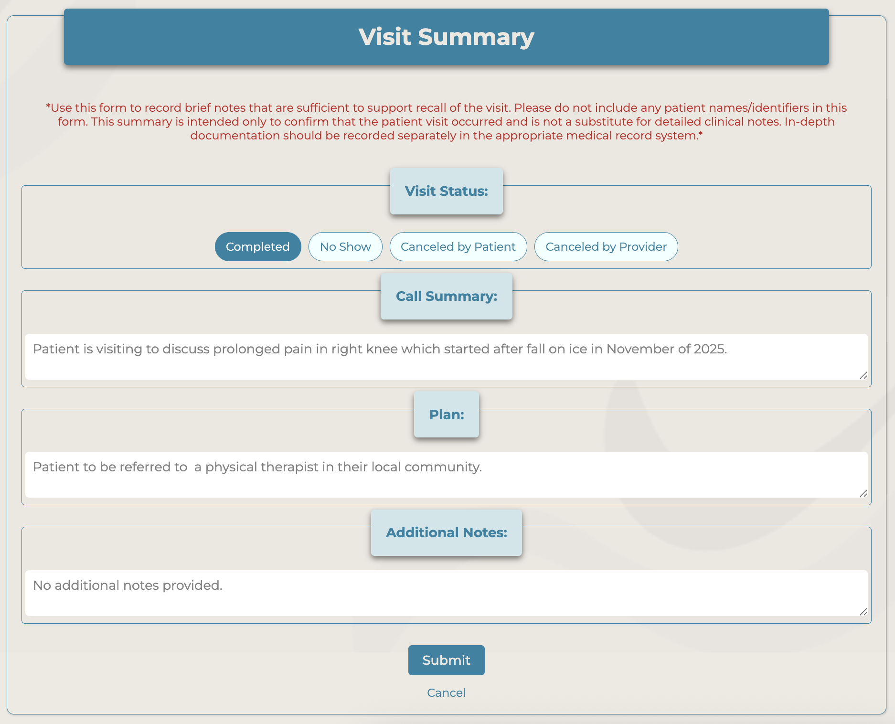
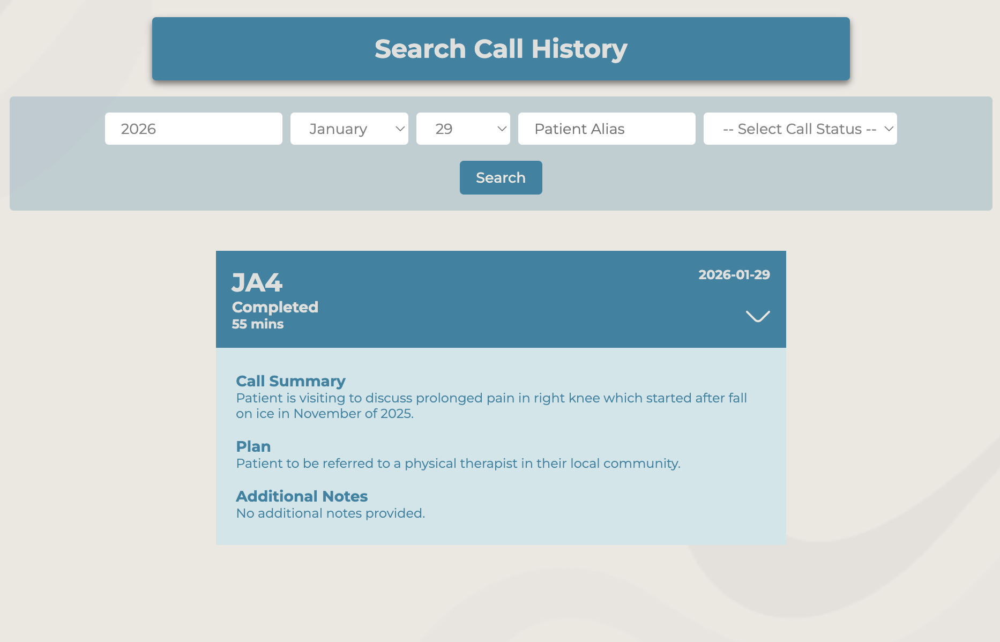

# WellWave Health Video Appointment Application

WellWave Health is an application I conceptualized to help clinicians make virtual appointments with patients easier.

---

## Overview

I designed WellWave Health to be used as a standard platform across a province or region so that all patients in the area would know that WellWave Health would be the platform they would utilize when their clinician booked a virtual appointment with them.

### **Why?**

The benefit to WellWave Health is that it does not request the patient to download an application like Teams or Zoom to attend an appointment. As long as they have an email, they will be able to get the link and enter their appointment in one click.

### **Meaning what?**

clinicians can be clinicians and can give the first 5 minutes of appointments back to patient care and not tech support

---

## How It Works

### **1:** Clinician creates call:

### **2:** Patient Alias is Created using patient name and DOB:

#### Using the clinician's EMR, the alias can be verified using the information in the EMR like the patient's name, DOB, and date of appointment

### **3:** Patient receives email and joins via the link provided in the body of the email. No third party apps:

### **4:** Provider and Patient join call:

### **5:** Provider can chart while in the call:

### **6:** Once the call is complete the notes save to the documentation page:

### **7:** Clinicians can view their call history:

#### Again, using the EMR, the alias can be verified

## Key Features

- User authentication (JWT + cookies)
- Ability for providers to take and save notes regarding appointments
- Patient alias system (no personal identifiers stored)
- Resend API for emailing patients links to appointments
- WebRTC for real-time video and audio
- Socket.io for signaling and real-time communication

---

## Tech

- JS
- HTML/CSS
- SQL
- JWT
- Cookies

---

## Running the App Locally (Development)

1. Clone the project folder.
2. Run `npm install` to install dependencies.
3. Use `npm run devStart` to launch the app.
4. Visit [http://localhost:3000](http://localhost:3000) in your browser.

---

## Side Note

This project is an improved version of a previous iteration (hidden). Commit history may appear condensed/not standard because a significant portion of the initial development and detailed commit work was completed in a prior private version of this project.

---

Thank you for reviewing my project!  
Feel free to contact me with any questions.
